## Bot de Telegram

### Indice

> 1. Echo
> 2. Dispatcher
> 3. Polls
> 4. Intento de Webhook
> 5. Nuestro Bot

### Echo
Si el echo esta activado, es capaz de reproducir cualquier mensaje que le indiquemos despues de introducir un comando

~~~
command("start") {
         val result = bot.sendMessage(chatId = ChatId.fromId(message.chat.id), text = "Hi there!")
}
~~~
### Dispatcher
El dispatcher se centra en el enviado de respuestas o comandos que contienen un estilo de texto diferente.
Tenemos respuestas del bot con:
~~~
message(Filter.Sticker) {
    bot.sendMessage(ChatId.fromId(message.chat.id), text = "¿En serio no tienes un esticker mejor para enviame?")
}
message(Filter.Reply or Filter.Forward) {
    bot.sendMessage(ChatId.fromId(message.chat.id), text = "Damian, tienes que aprobar a Joel y Brais")
}
~~~
Que saldrian asi:

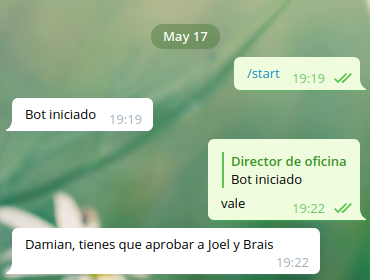

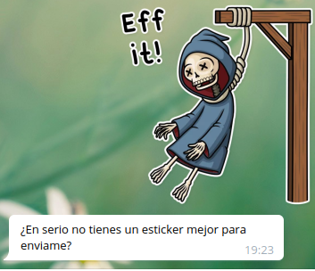

Si queremos darle estilo a nuestro texto del bot podemos usar markdown para ello.
Aqui dos ejemplos de codigo con markdown:
~~~
command("markdown") {
    al markdownText = "_Mi gran mensaje_: *Markdown* es `util a su manera`"
    bot.sendMessage(
        chatId = ChatId.fromId(message.chat.id),
        text = markdownText,
        parseMode = ParseMode.MARKDOWN
    )
}
~~~
~~~
command("markdown2") {
                val markdownV2Text = """
                    *negrita*
                    _italic_
                    __subrallado__
                    ~tachado~
                    *negrita _italic negrita ~italic negrita tachada~ __subrallado italic negrita___ negrita*
                    [Nuestro bot](https://github.com/jnunesvazquez/Telegram_Bot)
                    [inline mention of a user](tg://user?id=123456789) 
                    `inline fixed-width code`
                    ```kotlin
                    fun main() {
                        println("Hello Kotlin!")
                    }
                    ```
                """.trimIndent()
                bot.sendMessage(
                    chatId = ChatId.fromId(message.chat.id),
                    text = markdownV2Text,
                    parseMode = ParseMode.MARKDOWN_V2
                )
}
~~~
En telegram se veria tal que asi respectivamente:

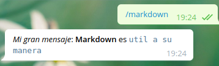

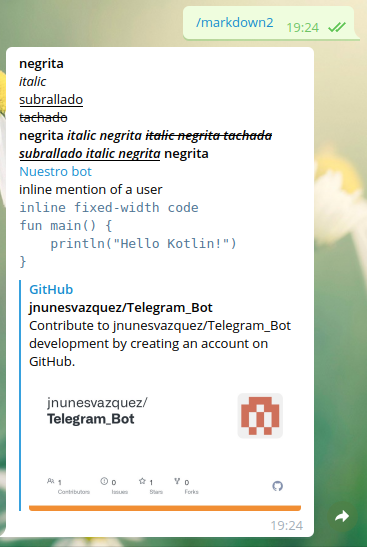

Se puede apreciar que en la segunda imagen el markdown esta mejorado y nos permite enviar url.

Tambien podemos llamar a botones que nos muestren un texto o nos habran una ventana emerjente:
~~~
            command("inlinebuttons") {
                val inlineKeyboardMarkup = InlineKeyboardMarkup.create(
                    //text es el texto que aparece en el boton
                    //callbackData Retoena el callbackQuery asociado (linea de codigo )
                    listOf(InlineKeyboardButton.CallbackData(text = "Presioname", callbackData = "Madre mia")),
                    //text es el texto que aparece en el boton
                    //callbackData Retoena el callbackQuery asociado (linea de codigo )
                    listOf(InlineKeyboardButton.CallbackData(text = "Hola", callbackData = "Quiero mi 10"))
                )
                bot.sendMessage(
                    chatId = ChatId.fromId(message.chat.id),
                    text = "Mis botones, pulsalos a placer",
                    replyMarkup = inlineKeyboardMarkup
                )
            }
            callbackQuery("Madre mia") {
                val chatId = callbackQuery.message?.chat?.id ?: return@callbackQuery
                bot.sendMessage(ChatId.fromId(chatId), callbackQuery.data)
            }
            callbackQuery(
                callbackData = "Quiero mi 10",
                callbackAnswerText = "Por el duro esfuerzo en realizar esta tarea quiero mi 10, no espero menos que eso",
                callbackAnswerShowAlert = true
            ) {
                val chatId = callbackQuery.message?.chat?.id ?: return@callbackQuery
                bot.sendMessage(ChatId.fromId(chatId), callbackQuery.data)
            }
~~~
La primera parte del codigo donde esta el comando creamos los botones, despues con el callbackQuery indicamos que nos imprima un texto o una ventana emergente.

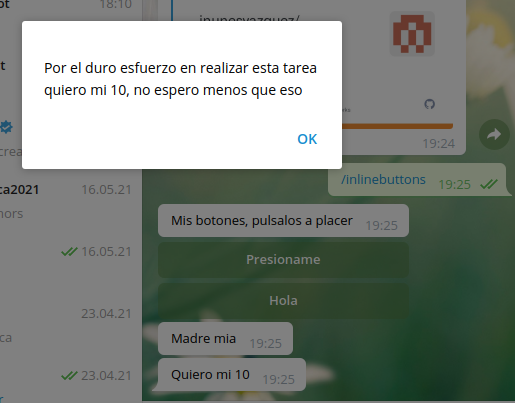

Tambien hay botones que aparecen donde el usuario escribe en vez de en el chat. En mi caso uno de los botones te envia la hubicacion con cordenadas y el otro envia tu contacto como usuario.
~~~
            command("f") {
                val keyboardMarkup = KeyboardReplyMarkup(keyboard = generateUsersButton(), resizeKeyboard = true)
                bot.sendMessage(
                    chatId = ChatId.fromId(message.chat.id),
                    text = "Aqui los botones de usuarios",
                    replyMarkup = keyboardMarkup
                )
            }
            fun generateUsersButton(): List<List<KeyboardButton>> {
                return listOf(
                listOf(KeyboardButton("Te digo tu localizacion (no lo soporta el ordenador)", requestLocation = true)),
                listOf(KeyboardButton("Envio tu numero de contacto ", requestContact = true))
                )
            }
            location {
                bot.sendMessage(
                    chatId = ChatId.fromId(message.chat.id),
                    text = "Tu localizacion es (latitud=${location.latitude}, longitud=${location.longitude})",
                    replyMarkup = ReplyKeyboardRemove()
                )
            }
            contact {
                bot.sendMessage(
                    chatId = ChatId.fromId(message.chat.id),
                    text = "Buenas, ${contact.firstName} ${contact.lastName}",
                    replyMarkup = ReplyKeyboardRemove()
                )
            }
~~~
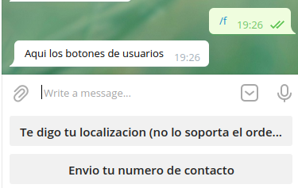

Tambien podemos hacer que el bot nos envie una imagen con un texto en su interior cuando lo despliegas.
~~~
            command("mediagroup") {
                bot.sendMediaGroup(
                    chatId = ChatId.fromId(message.chat.id),
                    mediaGroup = MediaGroup.from(
                        InputMediaPhoto(
                            media = TelegramFile.ByUrl("https://www.wallpapertip.com/wmimgs/67-674353_epic-anime-wallpapers-21118-hd-pictures-data-src.jpg"),
                            caption = "Asombrate de mis fotos Damian"
                        ),
                        InputMediaPhoto(
                            media = TelegramFile.ByUrl("https://images5.alphacoders.com/105/thumb-1920-1055769.jpg"),
                            caption = "Final Space best serie"
                        )
                    ),
                    replyToMessageId = message.messageId
                )
            }
~~~
Que nos enviaria unas fotos tal que asi:

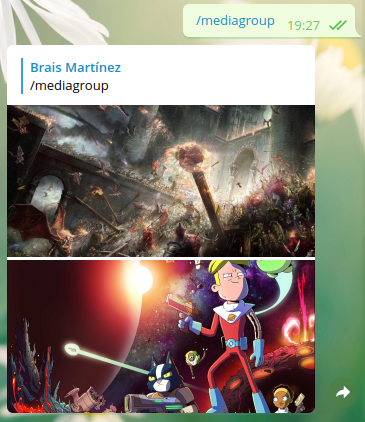

Tambien podemos introducir pequeños comandos que no tenemos que expecificarle a botFather para que nos envie un texto.
Para llamarlo solo habria que ponerlo con /YaquiELcomando. Pareceria como un huevo esconddido hasta ser usado.

~~~
            text("quiero") {
                bot.sendMessage(chatId = ChatId.fromId(message.chat.id), text = "Mi 10")
            }
~~~
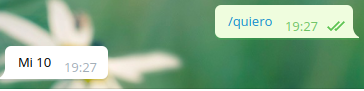

Respuestas a imagenes con un texto
~~~
            photos {
                bot.sendMessage(
                    chatId = ChatId.fromId(message.chat.id),
                    text = "Muy buena foto"
                )
            }
~~~
Que al enviarle una forto al bot te responderia con un **"Muy buena foto"**

Por ultimo tenemos el dado que nos envia un stiker animado de un dardo lazandose a una diana que sale aleatorio.
~~~
            command("dado") {
                bot.sendDice(ChatId.fromId(message.chat.id), DiceEmoji.Dartboard)
            }
            //cuando reenvias la diana a el bot por privado te devuelve la puntiacion
            dice {
                bot.sendMessage(ChatId.fromId(message.chat.id), "Un dado ${dice.emoji.emojiValue} con valor ${dice.value} ha sido recivido")
            }
~~~
Al reenviarlo al bot te sale la puntuación.

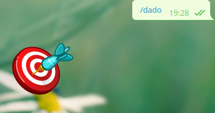
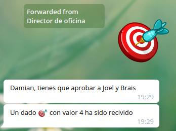
### Polls
Las polls se tratan de encuestas en las que podemos votar en encuestas de opinion o contestar a preguntas de informacion general. Existen de dos tipos, las QUIZ (Preguntas con una respuesta correcta) y las REGULAR (Pueden o no tener una respuesta correcta)

~~~
command("poll") {
        bot.sendPoll(
            chatId = ChatId.fromId(message.chat.id),
            type = QUIZ,
            question = "El mejor profesor de programacion?",
            options = listOf(
                "Nina",
                "Ricardo",
                "Elisa",
                "Manuel(???)",
                "El petardo y mas increible vago DAMIAAAAAAAAN!!!!"
            ),
            correctOptionId = 4,
            openPeriod = 60,
            isAnonymous = false
        )
    }
~~~

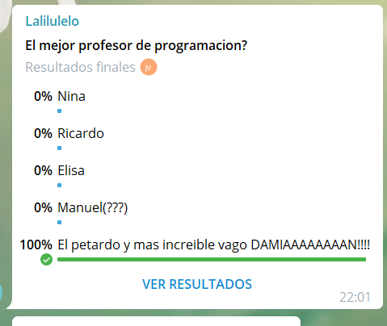
### WebHook
(Hemos intentado hacerlo pero nos hemos quedado a mitad del camino por falta de conocimiento y muchos intentos)

Se trata de otra forma de acceder a la API de Telegram en vez de utilizar el getUpdates y con la ventaja de hacerlo con una URL de un dominio propio
Para poder hacerlo se necesita un certificado del servidor de terceros, una URL propia, una clave privada, otra publica y una de almacenamiento.
Despues de crear el enlace con nuestra URL, podremos recibir notificaciones de Telegram desde nuestro dominio
> Proceso

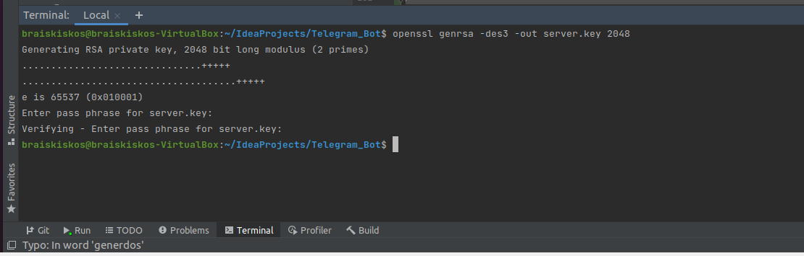
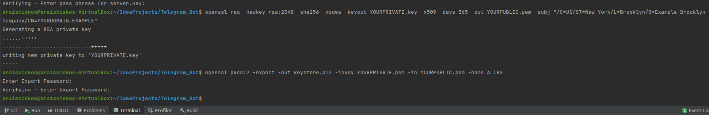
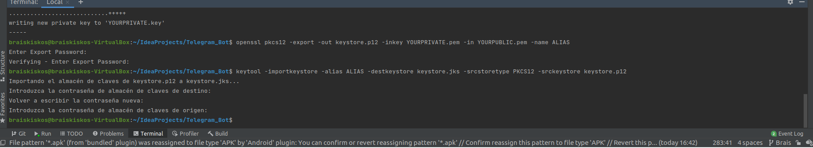

Generaremos estos cuatro archivos que se supone que tenemos que utilizar en el ourbot

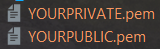
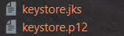

### Nuestro Bot

### Autores

Joel Jorge Nunes Vázquez 

Brais Martínez Paredes
